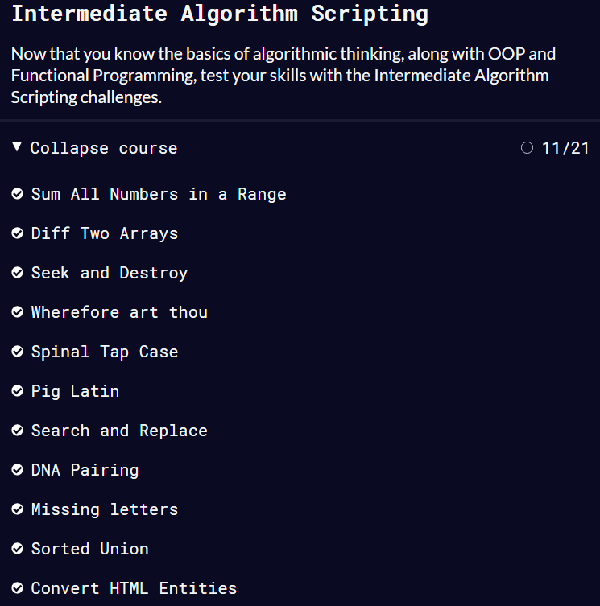

# kottans-frontend

[Інфо про курс](https://github.com/kottans/frontend/blob/2022_UA/README.md) | [Зміст курсу](https://github.com/kottans/frontend/blob/2022_UA/contents.md) | [FAQ](https://github.com/kottans/frontend/blob/2022_UA/faq.md) | [markdown](https://help.github.com/categories/writing-on-github/) | [Typical mistakes](http://kottans.org/documentation/docs/doc/code-review/#typical-mistakes) | [HTML validator](https://validator.w3.org/#validate_by_input) | [CSS validator](https://jigsaw.w3.org/css-validator/#validate_by_input)

## 0. Git Basics

0.1 [Introduction to Git and GitHub (week 1&2)](https://www.coursera.org/learn/introduction-git-github)  
Оновила знання про основні комманди та функції Git'а. Аналогія _working tree_ з _workingbench_ допомогла легше засвоїти в свою чергу, що таке **_stage area_** та **_commit_**.  
`git log --graph --oneline` можливість графічно відобразити історію бранчування та злиття гілок здалася досить цікавою.  
`git commit -a -m "comment"` буду використовувати у майбутньому для якихось маленьких правок.

Week 1&2

0.2 [learngitbranching.js.org](https://learngitbranching.js.org/)  
Цікаві та складні завдання. Деяка інформація зовсім заплутала, деяка навпаки домогла. Наприклад, стало легше розрізняти між собою `rebase` та `cherry-pick`. А поєднання `git fetch` та `git merge` в одній команді `git pull` здається зручним.

Screenshots

0.3 pull-request до [Kottans/mock-repo](https://github.com/Kottans/mock-repo) is [successfully merged and closed](https://github.com/kottans/mock-repo/pull/999).

## 1. Linux CLI, and HTTP

1.1 [Linux Survival (4 modules)](https://linuxsurvival.com/linux-tutorial-introduction/)  
До цього знала лише декілька команд типу `cd`, `pwd`, `ls`.  
Ознайомилася з корисними командами (`mkdir`, `cp`, `cat`, `mv`, `rmdir`, `find`, `man`), які допомагають швидше справитись з певними завданнями ніж при використанні ui.  
Здвивували: команда для переміщення `mv` файлів може використовуватись також для перейменування; оператор `|`, що передає одержані дані з однієї команди - в іншу.

Screenshots

 

1.2 & 1.3 [HTTP: Протокол, який повинен розуміти кожний веб-розробник - Частина 1](https://code.tutsplus.com/uk/tutorials/http-the-protocol-every-web-developer-must-know-part-1--net-31177) & [Частина 2](https://code.tutsplus.com/uk/tutorials/http-the-protocol-every-web-developer-must-know-part-2--net-31155)  
Якийсь базовий матеріал про те як працює HTTP знала до цього. Зі статті дізналась про: існування ще й таких методів як `HEAD`, `TRACE`, `OPTIONS`; що існує і паблік кешування, яке розміщено на проксі серверах для зменшення навантаження на сервер, де розміщені потрібні дані; що актуальність кешованої версії можна контролювати за допомоги спеціальних заголовків `Cache-Control`. Крім того, цікаво, що клієнт може також брати участь у "контролі" над актуальністю контенту за допомоги заголовків у своєму запиті.

## 2. VCS (hello gitty), GitHub and Collaboration

2.1 [Introduction to Git and GitHub (week 3&4)](https://www.coursera.org/learn/introduction-git-github)

Багато цікавого і нового: воркфлоу з pr, як оновлювати свій pr; `git rebase -i` інтерактивний rebase, який має багато функцій, одна із яких дозволяє `squash` декілька комітів в один; про особливість `rebase` - переписувати історію коммітів, роблячи її лінійною, і це не завжди рекомендовано робити на колабораційних проектах; можливість на гітхабі створювати своєрідний todo list для проекта, призначати, хто за що відповідає, і за допомоги коментаря у коміті `"Close #<number-of-the issue>"` відмічати відповідний пункт закритим.

Week 3&4

2.2 [learngitbranching.js.org](https://learngitbranching.js.org/)

Заново пройшла ті рівні які здалися на 0 степі важкими і вони стали більш зрозумілими і легкими. Практиковалась з `rebase` і `cherry-pick`; зрозуміла що ж таке `origin` і як за допомоги команд можна пушити локальну гілку у іншу на ремоут якщо вони мають різні назви, наприклад: `git push origin foo:main`, де foo - це локальна гілка, а мейн - це віддалена.  
Здивувало, що `fetch` та `pull` можуть видаляти та створювати гілки:  
`git push origin :foo` - видалить на ремоуті гілку foo  
`git fetch origin :foo` - створить локально гілку foo

Screenshots

## Intro to HTML and CSS

3.1 [Intro to HTML & CSS (week 1&2)](https://www.coursera.org/learn/html-css-javascript-for-web-developers)

Week 1&2

3.2 [Codecademy - Learn HTML(Eng)](https://www.codecademy.com/learn/learn-html) &  
3.3 [Codecademy - Learn CSS(Eng)](https://www.codecademy.com/learn/learn-css)

Screenshot

Загалом це було повторення та систематизація того з чим вже була знайома. Дізналась про _content model_ для HTML5, яка відносить більшість html елементів до певної [категорії](https://html.spec.whatwg.org/#content-models). Ще з цікавого та нового:

- `minlength` та `maxlength` атрібути для `<input>`;
- `&nbsp` не тільки створює проміжок між словами, але й робить їх _nonbreakable_;
- `<a>` є одночасно рядковим та блоковим елементом: він може містити в собі блокові елементи, але за замовчуванням має поведінку рядкового елемента;
- `margin` у `float` елементів не колапсуються;
- як додавати кастомні шрифти за допомогою [`@font-face`](https://css-tricks.com/snippets/css/using-font-face-in-css/).

## 4. Responsive Web Design

4.1 [Responsive web design basics](https://web.dev/i18n/en/responsive-web-design-basics/)  
4.2 [Flexbox](https://www.youtube.com/playlist?list=PLM6XATa8CAG5mPV60dMmjMRrHVW4LmV2x) & 4.4 [CSS Grid Layout](https://www.youtube.com/watch?v=GV92IdMGFfA&list=PLM6XATa8CAG5pXQrW_kDaeZb_uIAMNZIm)  
4.3 [Flexbox Froggy](http://flexboxfroggy.com/) & 4.5 [Grid Garden](http://cssgridgarden.com/)

Про флекс вже знала до цього, тому було переважно повторення, а у гріди занурилась вперше. Кількість властивостей та скорочень для них вражає так само, як і можливості які дають гріди. З цікавого:

- з `grid-template-areas` можна 'візуально' впорядкувати грід-елементі, а `grid-auto-rows` та `grid-auto-columns` дають можливість задавити розміри неявних колонок та рядків.
- ми можемо задавати назви для грід ліній `grid-template-columns: [first] 40px [line2] 50px [line3] auto [end]`;
- брейкпоінти краще задавати в прив'язці до того, коли 'ламається' лейаут сторінки, а не до розмірів різних девайсів.
- медіа запити `hover`, `pointer`, `any-hover`, `any-pointer`.

Games

[Гайд по грідам](https://css-tricks.com/snippets/css/complete-guide-grid/#top-of-site)

## 5. HTML & CSS Practice

Мабуть єдине практичне завдання в виконанні якого я була більш-менш впевнена, бо тут лише CSS&HTML. Вирішила зробити розмітку для менюшки з айконами на грідах, бо з ними ніколи не практиковалась, а тут така нагода. Трохи намучалась з тим, щоб самі іконки нормально відображались - зі збереженням потрібних пропорцій, та без обрізання. Що було складно оскільки самі іконки були різного розміру. Але з цим справилась. Також стало зрозуміло коли треба використовувати `alt` для зображень-посилань, а коли ні.  
І це перший раз, коли мій код рев'юіли :D Цікавий та корисний досвід!

[Demo](https://nvklap.github.io/hooli-style-popup/) | [Code base](https://github.com/nvklap/hooli-style-popup) | [PR](https://github.com/kottans/frontend-2022-homeworks/pull/267)

Helpful Links

[nav section rules](https://developer.mozilla.org/en-US/docs/Web/HTML/Element/nav) | [checkbox video](https://www.youtube.com/watch?v=E6kLaaQFctU&ab_channel=VadimMakeev) | [Add favicon](https://www.w3.org/2005/10/howto-favicon) | [Svg color on hover](https://css-tricks.com/change-color-of-svg-on-hover/) | [Stop Targeting Tags in CSS](https://frontstuff.io/you-need-to-stop-targeting-tags-in-css)

## [6. JavaScript Basics](https://github.com/kottans/frontend/blob/2022_UA/tasks/js-basics.md)

6.1 [Intro to JS](https://www.coursera.org/learn/html-css-javascript-for-web-developers/home/week/4)  
6.2 [Basic JavaScript](https://www.freecodecamp.org/learn/javascript-algorithms-and-data-structures/basic-javascript/), [ES6 Challenges ](https://www.freecodecamp.org/learn/javascript-algorithms-and-data-structures/#es6) перші 17, [Basic Data Structures](https://www.freecodecamp.org/learn/javascript-algorithms-and-data-structures/#basic-data-structures), [Basic Algorithm Scripting](https://www.freecodecamp.org/learn/javascript-algorithms-and-data-structures/#basic-algorithm-scripting), [Functional Programming](https://www.freecodecamp.org/learn/javascript-algorithms-and-data-structures/#functional-programming), [Algorithm Scripting Challenges](https://www.freecodecamp.org/learn/javascript-algorithms-and-data-structures/#intermediate-algorithm-scripting) перші 11  
Вправи на кодкемпі більше сподобались ніж лекції на курсері. По-перше, своєю актуальністю та змогою тут же на місці попрактикуватись. По-друге, що є змога скористатись підказкою та подивитись варіанти розв'язання задачі. Це було корисно, бо там де я використовувала loops можна скористатись різними методами масивів та скоротити свій код вдвічі. Завдання, які були до розділу [Intermediate Algorithm Scripting](https://www.freecodecamp.org/learn/javascript-algorithms-and-data-structures/#intermediate-algorithm-scripting) давалися більш-менш легко, на деякі з них просто було треба витратити більше часу та зусиль, а ось деякі завдання в цьому розділі змусили відчути себе безмежно тупою. І скільки б часу на них не витрачала - з розв'язанням була просто біда, тому доводилось користуватися підказками. Трошки опускалися руки :/ Але після цього шла тренуватися на codewars та читати mdn. З цікавого:

- підгледіти наявність певної властивості у об'єкті можна не тільки за допомоги метода `hasOwnProperty()`. Існує і таке `'Alan' in users`;
- `NaN` не дорівнює нічому, навіть самому собі;
- `spread` оператор дозволяє дуже легко і елегантно скопіювати всі елементи масиву: `let newArr = [...arr]`;
- все про деструктурізацію - [Destructuring in JavaScript](https://www.freecodecamp.org/news/how-to-use-destructuring-in-javascript-to-write-cleaner-more-powerful-code-9d1b38794050/).

Screenshots

  

  
  

## [7. Document Object Model](https://github.com/kottans/frontend/blob/2022_UA/tasks/js-dom.md)

7.1 [Розділ Document Object Model Manipulation](https://www.coursera.org/learn/html-css-javascript-for-web-developers/home/week/5)  
7.2 [ Algorithm Scripting Challenges](https://learn.freecodecamp.org/javascript-algorithms-and-data-structures/intermediate-algorithm-scripting) 12 - 18

З алгоритмами знов були проблеми, довго давались, але кількість самостійного розв'язання без підглядання у хінти збільшилась. І вже частіше використовую потрібні методи, а не костилі у вигляді `for loops`. З DOM було набагато легше, бо це моя найулюбленіша тема JS. З плейліста [Бреда Траверсі](https://www.youtube.com/watch?v=0ik6X4DJKCc&list=PLillGF-RfqbYE6Ik_EuXA2iZFcE082B3s) отримала більше корисного, ніж від курсу на курсері:

- нові елементи на сторінку можна добавляти і через `innerHTML` (тут потрібен рядок з розміткою), і через метод `append()`;
- краще створити елементи, присвоїти їм потрібні атрибути, задати потрібну структуру, і вставити все це за один раз в сторінку, ніж вставляти кожний елемент окремо;
- [event delegation](https://javascript.info/event-delegation).

[Demo](https://nvklap.github.io/dom-prjct/) | [Code base](https://github.com/nvklap/dom-prjct) | [PR](https://github.com/kottans/frontend-2022-homeworks/pull/389)

Screenshots

## 8. Building a Tiny JS World

Найбільшою складністю для мене стало саме виведення значень об'єкта без використання рядків. Довго розмірковувала над тим, як в цьому можуть допомогти методи `map` та `join`. Стало зрозуміло, чому методи об'єкта (`keys`, `values`, `enteries`) для цього завдання виявилися непотрібними - вони не гарантують порядку виведення ключів та значень. Вирішила проблему створивши масив з ключами об'єктів і вже до нього примінила методи `map` та `join`.

[Demo](https://nvklap.github.io/a-tiny-JS-world/) | [Code base](https://github.com/nvklap/a-tiny-JS-world) | [PR](https://github.com/kottans/frontend-2022-homeworks/pull/434)

## 9. Object oriented JS

9.1 [ООП - Класи](https://www.youtube.com/watch?v=jgCiWIdUZ-s&list=PLM7wFzahDYnEltE-aVGhRHYPwIJn0Xquu&index=40) & [ООП - Прототипи](https://www.youtube.com/watch?v=e-3GS5-rak8&list=PLM7wFzahDYnEltE-aVGhRHYPwIJn0Xquu&index=46)

- `[[Prototype]]` містить посилання на інший об'єкт, чи має значення `null`;
- для наслідування властивостей - `Parent.call(propertyNames)`;
- для наслідування методів - `Child.prototype = Object.create(Parent.prototype)`;

[Demo](https://nvklap.github.io/frontend-nanodegree-arcade-game/) | [Code base](https://github.com/nvklap/frontend-nanodegree-arcade-game) | [PR](https://github.com/kottans/frontend-2022-homeworks/pull/498)

Screenshots

## 10. OOP exercise

[Demo](https://nvklap.github.io/a-tiny-JS-world/) | [Code base](https://github.com/nvklap/a-tiny-JS-world)
