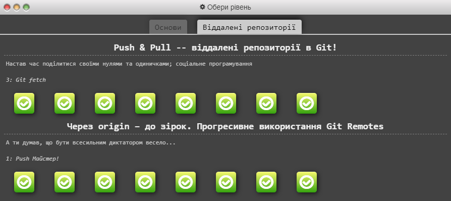

# kottans-frontend

[Загальна інфо про курс](https://github.com/kottans/frontend/blob/2022_UA/README.md) | [Зміст курсу](https://github.com/kottans/frontend/blob/2022_UA/contents.md) | [FAQ](https://github.com/kottans/frontend/blob/2022_UA/faq.md) | [markdown](https://help.github.com/categories/writing-on-github/)

## 0. Git Basics

0.1 [Introduction to Git and GitHub (week 1&2)](https://www.coursera.org/learn/introduction-git-github)  
Оновила знання про основні комманди та функції Git'а. Аналогія _working tree_ з _workingbench_ допомогла легше засвоїти в свою чергу, що таке **_stage area_** та **_commit_**.  
`git log --graph --oneline` можливість графічно відобразити історію бранчування та злиття гілок здалася досить цікавою.  
`git commit -a -m "comment"` буду використовувати у майбутньому для якихось маленьких правок.

Week 1&2

0.2 [learngitbranching.js.org](https://learngitbranching.js.org/)  
Цікаві та складні завдання. Деяка інформація зовсім заплутала, деяка навпаки домогла. Наприклад, стало легше розрізняти між собою `rebase` та `cherry-pick`. А поєднання `git fetch` та `git merge` в одній команді `git pull` здається зручним.

Screenshots

0.3 pull-request до [Kottans/mock-repo](https://github.com/Kottans/mock-repo) is [successfully merged and closed](https://github.com/kottans/mock-repo/pull/999).

## 1. Linux CLI, and HTTP

1.1 [Linux Survival (4 modules)](https://linuxsurvival.com/linux-tutorial-introduction/)  
До цього знала лише декілька команд типу `cd`, `pwd`, `ls`.  
Ознайомилася з корисними командами (`mkdir`, `cp`, `cat`, `mv`, `rmdir`, `find`, `man`), які допомагають швидше справитись з певними завданнями ніж при використанні ui.  
Здвивували: команда для переміщення `mv` файлів може використовуватись також для перейменування; оператор `|`, що передає одержані дані з однієї команди - в іншу.

Screenshots

 

1.2 & 1.3 [HTTP: Протокол, який повинен розуміти кожний веб-розробник - Частина 1](https://code.tutsplus.com/uk/tutorials/http-the-protocol-every-web-developer-must-know-part-1--net-31177) & [Частина 2](https://code.tutsplus.com/uk/tutorials/http-the-protocol-every-web-developer-must-know-part-2--net-31155)  
Якийсь базовий матеріал про те як працює HTTP знала до цього. Зі статті дізналась про: існування ще й таких методів як `HEAD`, `TRACE`, `OPTIONS`; що існує і паблік кешування, яке розміщено на проксі серверах для зменшення навантаження на сервер, де розміщені потрібні дані; що актуальність кешованої версії можна контролювати за допомоги спеціальних заголовків `Cache-Control`. Крім того, цікаво, що клієнт може також брати участь у "контролі" над актуальністю контенту за допомоги заголовків у своєму запиті.

## 2. VCS (hello gitty), GitHub and Collaboration

2.1 [Introduction to Git and GitHub (week 3&4)](https://www.coursera.org/learn/introduction-git-github)

Week 3&4

2.2 [learngitbranching.js.org](https://learngitbranching.js.org/)

## Intro to HTML and CSS

3.1 [Intro to HTML & CSS (week 1&2)](https://www.coursera.org/learn/html-css-javascript-for-web-developers)

Week 1&2

3.2 [Codecedemy - Learn HTML(Eng)](https://www.codecademy.com/learn/learn-html) &  
3.3 [Codecedemy - Learn CSS(Eng)](https://www.codecademy.com/learn/learn-css)

Screenshot

Загалом це було повторення та систематизація того з тим, чим вже була знайома. Дізналась про content model для HTML5, яка відносить більшість html елементів до певної [категорії](https://html.spec.whatwg.org/#content-models). Ще з цікавого та нового:

- `minlength` та `maxlength` атрібут для `<input>`;
- `&nbsp` не тільки створює проміжок між словами, але й робить їх nonbreakable;
- `<a>` є одночасно рядковим та блоковим елементом: він може містити в собі блокові елементи, але за замовчуванням має поведінку рядкового елемента;
- зовнішні відступи у `float` елементів не колапсуються;
- як додавати кастомні шрифти за допомогою [`@font-face`](https://css-tricks.com/snippets/css/using-font-face-in-css/).

<!-- 

WIP

 -->
